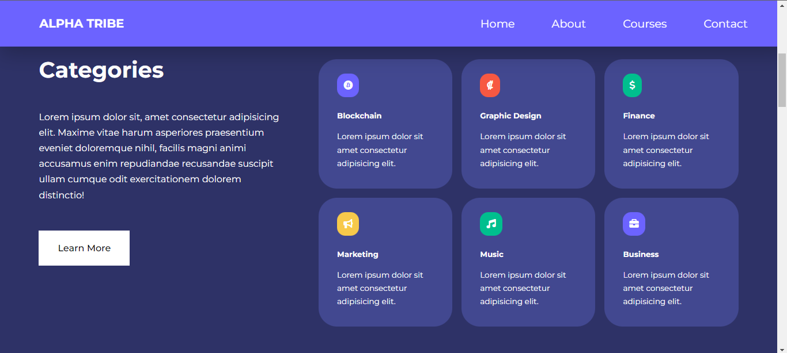
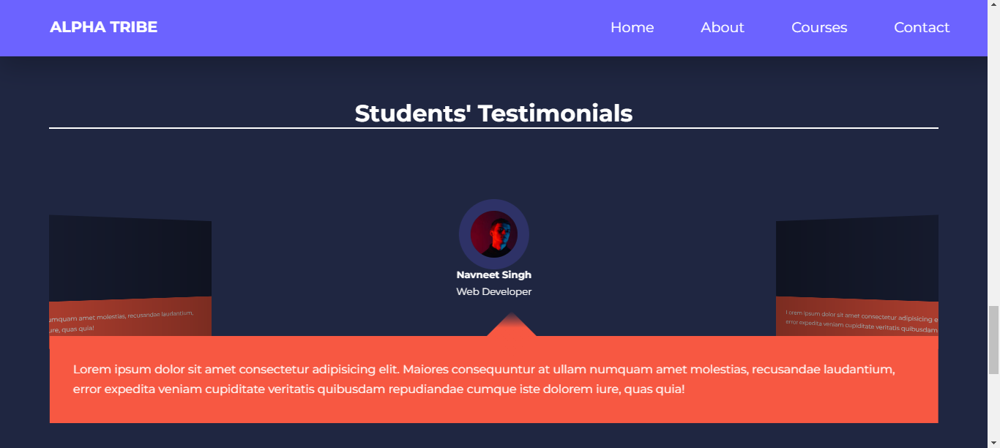

## By Chitesh Mahotra
### Project Name: ALPHA TRIBE EDUCATION WEBSITE

#### I hope you all like this website, I made this website with the help of HTML, CSS, JavaScript.
- The new thing I learnt by making this website is SwiperJS and Formspree.
  - Through SwiperJS I was able to make beautiful swiper slides.
  - Through Formsfree I was able to link my gmail to the website and now whoever fill the form, I will able to get his details. 

  ### Average Time Taken: 4 Days

- Here is the link of the website
- [Click Here](https://alpha-tribe-education-website.netlify.app/)

